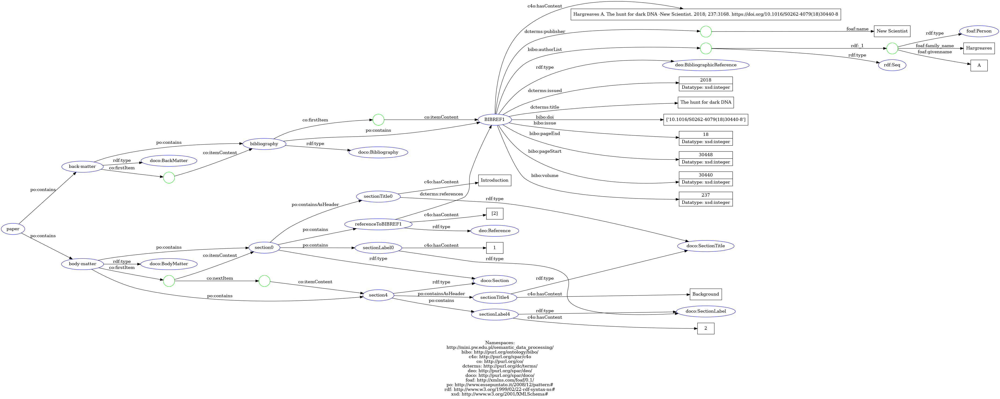
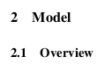

# section-and-bibliography-ie
Section &amp; bibliography information extraction

## Features

The following tool aims to extract some structured information, namely section information and bibliography, that is contained within a scientific paper.
The information captured is written in a semantic manner based on ontology.
For a given PDF file, an application generates a corresponding TTL file with all the relevant data extracted.

To be specific, the application tries to extract the following contest:

1. Bibliographical data, which is an ordered list of bibliographical entries, which is usually located at the end of the document. Each entry may contain the following information:
    - Raw text - the whole bibliographical reference text as it appears in the Bibliography section.
    - Authors - on an ordered list of authors, as written in the document. The application tries to parse the first and last names of every author.
    - Title.
    - Year.
    - Venue.
    - Volume.
    - Issue.
    - Pages.
    - DOI.
2. Section data, which is an ordered list of section entries. Each such entry contains the following information:
    - Section title.
    - Section number.
    - List of references to entries in bibliographical data. For clarity, if a specific citation appears in some section, then the section entry in the output TTL file will contain a reference to the corresponding bibliographical entry.

The ontology is strongly based on DOCO and BIBO ontologies. DOCO provides [comprehensive examples](http://www.sparontologies.net/ontologies/doco). The BIBO ontology, and other ontologies that it relies on, can be conveniently browsed after downloading `bibo.rdf.xml` using, e.g., Protégé.

## Running

1. `docker build . -t [some name]:[some tag]` (it takes a while!)
2. Put your papers in the `common` directory. The following commands assume that this directory is shared between your running container and host.
3. `docker run -v $(pwd)/common:/common [some name]:[some tag]`.
4. Run `docker ps` and check the name of your running container.
5. Attach to your container by executing `docker exec -it [name of running instance] bash`. Note that you can press TAB to get a hint on the name of your instance.
6. Now, you can call `./run.sh /path/to/your/pdf/file.pdf`. If you followed the commands above, the exemplary command might be `./run.sh /common/paper.pdf`. The output TTL will be produced in the same location. The name of the output file is based on the parsed name of the paper, suffixed with "_sections_biblio_ie". This is a common convention that we agreed on across the teams.

Remark: You should be able to call the `/s2orc-doc2json/run.sh` script from any directory, as it should resolve the paths correctly.

## Internal

Our application relies on the solution provided by AllenAI, namely [s2orc-doc2json](https://github.com/allenai/s2orc-doc2json).
The pipeline consists of two stages:

1. Extracting the data from provided PDF paper into a JSON file. This step is conducted fully by the `s2orc-doc2json`.
2. Parsing the JSON file and creating an RDF graph, which is further serialized into the ultimate Turtle format.

Due to the use of an external solution, all errors that it yields affect the quality of the final TTL files. 
We noticed that the vast majority of errors related to the invalid parsing of sections by the `s2orc-doc2json`.
Our code tries to overcome those that we have been able to catch in tests and are solvable.
However, there are probably many more such edge cases to be handled.
Some details of the problem are provided [further](#head1234).

## Examples

### Sample graph

In this section, we provide a quick overview of the content of generated files.

First, the following image presents an exemplary graph that can be potentially created using the application:



Now let's go through the details.

An instance `:paper` always is the root of the graph. It consists of `:back_matter` and `:body_matter` instances of the appropriate classes.
The `:back_matter` contains only the `:bibliography` instance.
However, the `:body_matter` contains all the top-level sections.
Note that according to [DOCO examples](http://www.sparontologies.net/ontologies/doco), whenever we want to introduce an order of elements that are contained in some instance, apart from using `po:contains`, we also use `co:firstItem`, `co:nextItem` and `co:itemContent` properties.

Let's focus on the `:bibliography`, which is of type `doco:Bibliography`. It contains an ordered list of bibliographical entries of type `deo:BibliographicReference` (the class used in DOCO examples). It can have the following properties attached:
- `c4o:hasContent` - raw text
- `bibo:authorList` - sequence of `foaf:Person` instances with given names and family names
- `dcterms:title` - title
- `dcterms:issued` - year
- `dcterms:publisher` - a `foaf:name` of the corresponding instance describes a venue
- `bibo:volume` - volume
- `bibo:issue` - issue
- `bibo:pageStart` and `bibo:pageEnd` OR `bibo:pages` - pages
- `bibo:doi` - DOI

Each section of class `doco:Section` may have `po:containsAsHeader` property which points to an instance of type `doco:sectionTitle` storing a string title.
In addition, a section can contain (`po:contains`) a label of type `doco:SectionLabel` being a section number.
Furthermore, `po:contains` is used to link a section to bibliographical references by pointing to instances of `deo: Reference` which further points to corresponding instances of `deo:BibliographicReference`.
A section may also contain subsections, which, apart from `po:contains`, are marked using `co:firstItem`, `co:nextItem`, and `co:itemContent` properties.

### Sample generated Turtle file

Transforming a paper `/common/paper2.pdf` yields `Attention_Is_All_You_Need_sections_biblio_ie.ttl` file. In the beginning, prefixes are introduced.
Then, you can find the following content:

```
:paper po:contains :back-matter,
        :body-matter .

:back-matter a doco:BackMatter ;
    co:firstItem [ co:itemContent :bibliography ] ;
    po:contains :bibliography .

:body-matter a doco:BodyMatter ;
    co:firstItem [ co:itemContent :section0 ;
            co:nextItem [ co:itemContent :section4 ;
                    co:nextItem [ co:itemContent :section8 ;
                            co:nextItem [ co:itemContent :section42 ;
                                    co:nextItem [ co:itemContent :section50 ;
                                            co:nextItem [ co:itemContent :section63 ] ] ] ] ] ] ;
    po:contains :section0,
        :section4,
        :section42,
        :section50,
        :section63,
        :section8 .
```

Note that the numbering of section instances may not correspond to their actual order and depends on the implementation.
In addition, recall that `po:contains` may not represent the actual order. The order is captured using `co:` namespace properties.

Let's look at the `:section8` instance:

```
:section8 a doco:Section ;
    co:firstItem [ co:itemContent :section10 ;
            co:nextItem [ co:itemContent :section12 ;
                    co:nextItem [ co:itemContent :section31 ;
                            co:nextItem [ co:itemContent :section34 ;
                                    co:nextItem [ co:itemContent :section35 ] ] ] ] ] ;
    po:contains :referenceToBIBREF1,
        :referenceToBIBREF28,
        :referenceToBIBREF4,
        :referenceToBIBREF8,
        :section10,
        :section12,
        :section31,
        :section34,
        :section35,
        :sectionLabel8 ;
    po:containsAsHeader :sectionTitle8 .
```
One can verify that the number of the section and title are:
```
:sectionLabel8 a doco:SectionLabel ;
    c4o:hasContent "3" .
```
and
```
:sectionTitle8 a doco:SectionTitle ;
    c4o:hasContent "Model Architecture" .
```

In addition, this section contains subsections. Let's check the `:section10`:

```
:section10 a doco:Section ;
    po:contains :referenceToBIBREF9,
        :sectionLabel10 ;
    po:containsAsHeader :sectionTitle10 .

:sectionLabel10 a doco:SectionLabel ;
    c4o:hasContent "3.1" .

:sectionTitle10 a doco:SectionTitle ;
    c4o:hasContent "Encoder and Decoder Stacks".
```

Finally, we see that `:section8` contains some references. We can check that the following triples exist:

```
:referenceToBIBREF28 a deo:Reference ;
    dcterms:references :BIBREF28 ;
    c4o:hasContent "[29]" .

:BIBREF28 a deo:BibliographicReference ;
    dcterms:issued 2014 ;
    dcterms:publisher [ foaf:name "Advances in Neural Information Processing Systems"] ;
    dcterms:title "Sequence to sequence learning with neural networks";
    bibo:authorList [ a rdf:Seq ;
            rdf:_1 [ a foaf:Person ;
                    foaf:family_name "Sutskever" ;
                    foaf:givenname "Ilya"] ;
            rdf:_2 [ a foaf:Person ;
                    foaf:family_name "Vinyals" ;
                    foaf:givenname "Oriol"] ;
            rdf:_3 [ a foaf:Person ;
                    foaf:family_name "Le" ;
                    foaf:givenname "Quoc Vv"] ] ;
    bibo:pageEnd 3112 ;
    bibo:pageStart 3104 ;
    c4o:hasContent "Ilya Sutskever, Oriol Vinyals, and Quoc VV Le. Sequence to sequence learning with neural networks. In Advances in Neural Information Processing Systems, pages 3104-3112, 2014.".
```


## <a name="head1234"></a>Known issues

As already noted, the most common issues pertain to the parsing of sections.
During the development, we have encountered various types of problematic `s2orc-doc2json` (recall that it parses PDF to JSON) behaviors, which include:
1. Not parsing the section number and the section title itself, e.g.:
    ```
    {
        "text": "1. Introduction",
        "cite_spans": [],
        "ref_spans": [],
        "eq_spans": [],
        "section": "",
        "sec_num": null
    }
    ```
1. Assigning the wrong section title and number, e.g.:
    ```
    {
        "text": "2. Our Strategy. Our strategy is based ....",
        "cite_spans": [],
        "ref_spans": [],
        "eq_spans": [],
        "section": "Our result",
        "sec_num": "1.2."
    }
    ```
1. Incorrect parsing of section and subsection, e.g.:

    

    ```
    {
        "text": "Figure 1: Overview of SPECTER.",
        "cite_spans": [],
        "ref_spans": [],
        "eq_spans": [],
        "section": "Model 2.1 Overview",
        "sec_num": "2"
    }
    ```
1. Parsing captions or other irrelevant text as section names (and this behavior is not consistent!), e.g.:
    ```
    {
        "text": "where N Circle is the number of microstates for a circle which is produced by joining dark.",
        "cite_spans": [],
        "ref_spans": [],
        "eq_spans": [],
        "section": "Figure 6: Topology of a system by adding some extra strings in extra dimensions change and shrinks to a circle",
        "sec_num": null
    }
    ```
    or
    ```
    {
        "text": "The general form of the function is f : T R m \u2212 > T R The target attribute value for the query instance x q is computed as given in equation (34)",
        "cite_spans": [],
        "ref_spans": [],
        "eq_spans": [],
        "section": "Step 3(b): For real-valued target function:",
        "sec_num": null
    }
    ```
1. Parsing only the number of a section without a title.
1. Not parsing roman numbers as section numbers.
1. In the case of references, repeatedly catching references with brackets, without brackets, with a bracket only on one side, etc.

We did our best to overcome issues 1., 5., 6., 7.
However, it does not mean that our solution can handle all the possible cases that one can imagine.
Our set of testing papers was highly limited.
The problem of parsing captions as sections sometimes may be of great importance, but we do not see any universal solution.
